# vLLM-in-PyTorch-Conference-2025

There are 53 videos (out of the full [117 videos](https://www.youtube.com/playlist?list=PL_lsbAsL_o2BUUxo6coMBFwQE31U4Eb2q) in PyTorch conference 2025) mentioning vLLM. The ratio is 45%, or around 50%.

## Keynote: Welcome & Opening Remarks - Matt White, Executive Director, PyTorch Foundation
- Link: https://www.youtube.com/watch?v=ACxHFY_zUb8

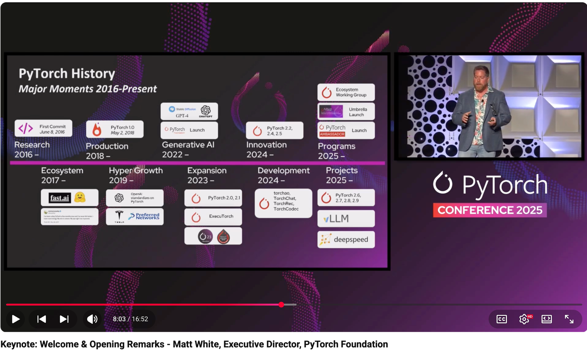

Keynote: Welcome & Opening Remarks - Matt White, Executive Director, PyTorch Foundation

## Keynote: vLLM & Deepspeed Updates - Simon Mo & Tunji Ruwase
- Link: https://www.youtube.com/watch?v=JQYP2l8x6oQ

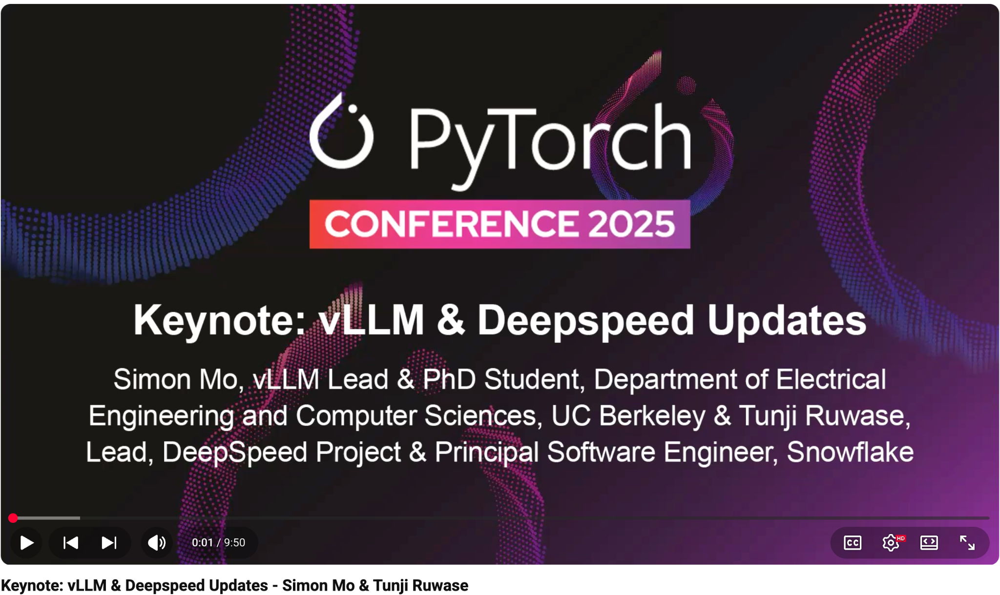

Keynote: vLLM & Deepspeed Updates - Simon Mo, vLLM Lead & PhD Student, Department of Electrical Engineering and Computer Sciences, UC Berkeley & Tunji Ruwase, Lead, DeepSpeed Project & Principal Softw

## Keynote: Ray: A Distributed Compute Engine for AI - Robert Nishihara & Ion Stoica
- Link: https://www.youtube.com/watch?v=B7U05Y4YcJg

Keynote: Ray: A Distributed Compute Engine for AI - Robert Nishihara, Co-Founder, Anyscale & Co-creator, Ray; Ion Stoica, Professor of Computer Science, UC Berkeley; Director of Sky Computing Lab; & C

## Keynote: Olmo-Thinking: Training a Fully Open Reasoning Model - Nathan Lambert
- Link: https://www.youtube.com/watch?v=uolCS_94c4A

Keynote: Olmo-Thinking: Training a Fully Open Reasoning Model - Nathan Lambert, Senior Research Scientist, Ai2 This talk covers the crucial details it takes to train a 7B parameter, fully open reasoni

## Open Source Model Performance Optimization With SGLang - Yineng Zhang, Together AI
- Link: https://www.youtube.com/watch?v=wDNfcv_fbWs

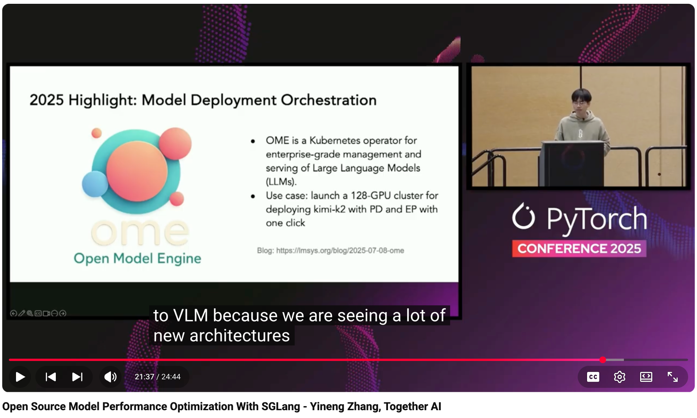

Open Source Model Performance Optimization With SGLang - Yineng Zhang, Together AI SGLang is an open-source fast inference framework in the PyTorch ecosystem built for performant, flexible, extensible

## PyTorch Symmetric Memory: A New Programming Paradigm for Distributed AI - Ke Wen & Chien-Chin Huang
- Link: https://www.youtube.com/watch?v=5vfcTjosGLg

PyTorch Symmetric Memory: A New Programming Paradigm for Distributed AI - Ke Wen & Chien-Chin Huang, Meta Recent advancements in models led by DeepSeek have highlighted the need for customized communi

## Sponsored Session: Lightning Talk: Accelerating Experimentation and Unlocking Real-Time Inference on Microcontrollers with Lightning - Niall Lyons & Luca Antiga
- Link: https://www.youtube.com/watch?v=mHC08Gf_xnc

Sponsored Session: Lightning Talk: Accelerating Experimentation and Unlocking Real-Time Inference on Microcontrollers with Lightning - Niall Lyons, Infineon Technologies & Luca Antiga, Lightning AI Jo

## Deploying GenAI for Audio Generation on Mobile CPUs With ExecuTorch - Gian Marco Iodice, Arm
- Link: https://www.youtube.com/watch?v=uM5yXhb60hw

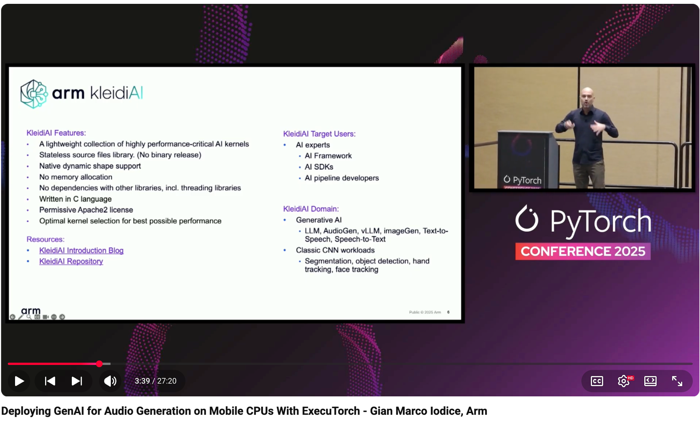

Deploying GenAI for Audio Generation on Mobile CPUs With ExecuTorch - Gian Marco Iodice, Arm Generative AI (GenAI) is often associated with cloud-based large language models (LLMs), but its capabiliti

## Sponsored Session: Beyond the Node: Scaling Inference with Cluster-Wide KVCache Management - Alon Yariv
- Link: https://www.youtube.com/watch?v=v_z5BqWi0aI

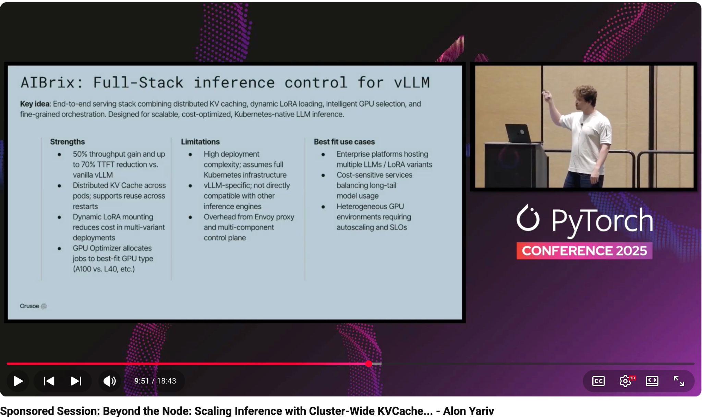

Sponsored Session: Beyond the Node: Scaling Inference with Cluster-Wide KVCache Management - Alon Yariv, Crusoe.ai While open-source frameworks like vLLM have revolutionized LLM inference on a single

## Lightning Talk: Hardware-Aware Python Packages ~ PyTorch and WheelNext Grab the Wheel! - Jonathan Dekhtiar & Eli Uriegas
- Link: https://www.youtube.com/watch?v=BH4c7QrGB7E

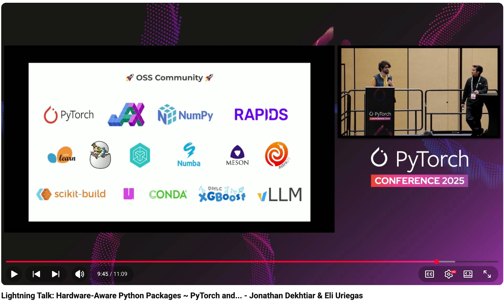

Lightning Talk: Hardware-Aware Python Packages ~ PyTorch and WheelNext Grab the Wheel! - Jonathan Dekhtiar, NVIDIA & Eli Uriegas, Meta The PyTorch ecosystem thrives on innovation and a vibrant open-so

## Our Journey With TorchTitan - Linsong Chu & Garrett Goon, IBM Research
- Link: https://www.youtube.com/watch?v=o1Ftb3gpeDs

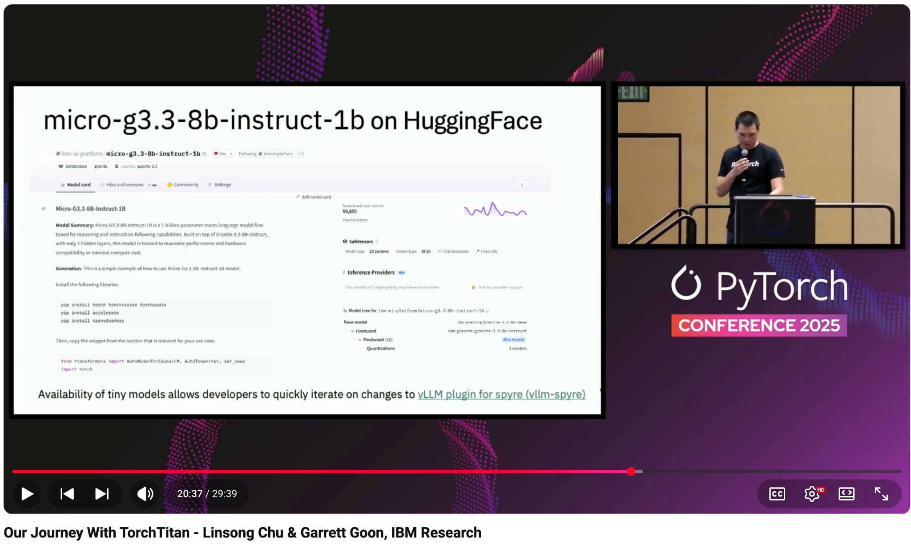

Our Journey With TorchTitan - Linsong Chu & Garrett Goon, IBM Research In this session, we will share our journey with TorchTitan over the past year and a half, starting from early 2024. During this j

## The Building Blocks of Agentic Al - Joe Spisak, Product Director, Meta Superintelligence Labs
- Link: https://www.youtube.com/watch?v=8mXp_wcQYng

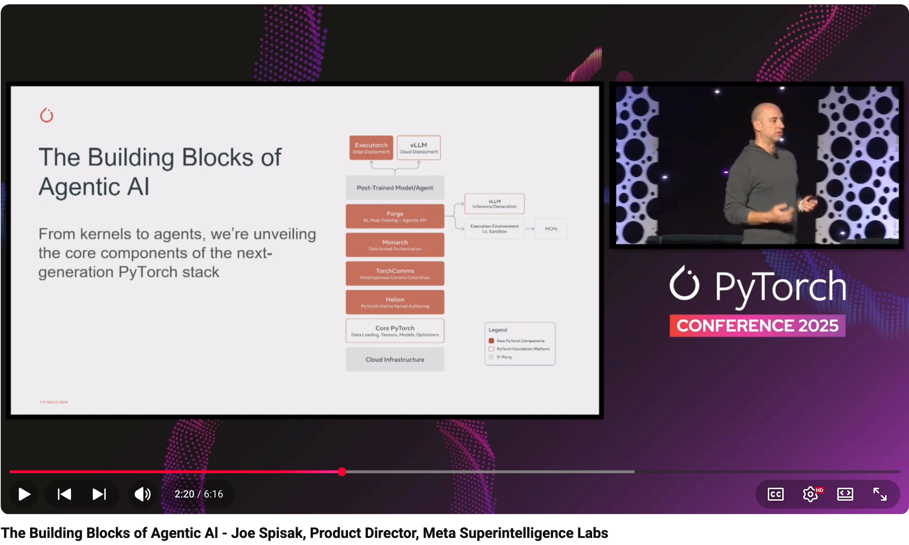

The Building Blocks of Agentic Al - Joe Spisak, Product Director, Meta Superintelligence Labs

## Sponsor Keynote: Build AI Anywhere with ROCm™ Software: AMD and PyTorch Bring Cloud-to-Client Power to Developers - Anush Elangovan
- Link: https://www.youtube.com/watch?v=RyFqJ82g4Yc

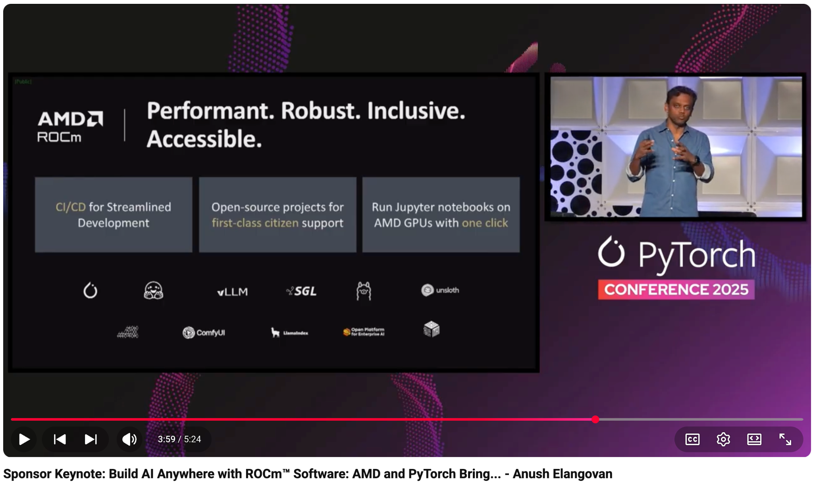

Sponsor Keynote: Build AI Anywhere with ROCm™ Software: AMD and PyTorch Bring Cloud-to-Client Power to Developers - Anush Elangovan, Corp. Vice President of AI Software, AMD In this keynote, Anush Ela

## Keynote: PyTorch Technical Deep Dive - Alban Desmaison, Peng Wu, Mark Saroufim & Edward Yang, Meta
- Link: https://www.youtube.com/watch?v=XdORM2pkyH8

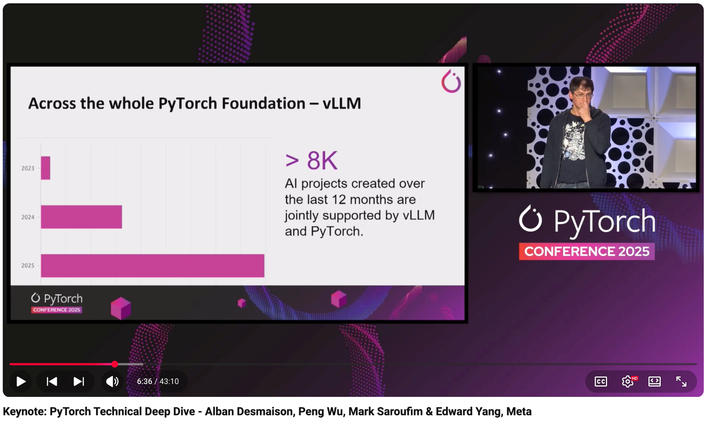

Keynote: PyTorch Technical Deep Dive - Alban Desmaison, Peng Wu, Mark Saroufim & Edward Yang, Meta This Deep Dive provides an update on PyTorch development since last conference and dives into key new

## Sponsored Session: Lightning Talk: Build and Deploy AI Flows with an Agent Factory - Arjun Upadhyay
- Link: https://www.youtube.com/watch?v=VfERNHVmL4o

Sponsored Session: Lightning Talk: Build and Deploy AI Flows with an Agent Factory - Arjun Upadhyay, Oracle Modern applications use AI models, informed by enterprise data to build impactful agentic wo

## Sponsored Session: Everything Everywhere all at Once: vLLM Hardware Optionality with Spotify and Google - Brittany Rockwell & Shireen Kheradpey
- Link: https://www.youtube.com/watch?v=769v67Gj-yU

Sponsored Session: Everything Everywhere all at Once: vLLM Hardware Optionality with Spotify and Google - Brittany Rockwell, Google & Shireen Kheradpey, Spotify Tired of being constrained to a single

## An Open Source Post-Training Stack: Kubernetes + Ray + PyTorch + vLLM - Robert Nishihara, Anyscale
- Link: https://www.youtube.com/watch?v=JEM-tA3XDjc

An Open Source Post-Training Stack: Kubernetes + Ray + PyTorch + vLLM - Robert Nishihara, Anyscale AI workloads require increasing scale for both compute and data, as well as significant heterogeneity

## PyTorch-Native Stack for Agents - Allen Wang & Davide Testuggine, Meta
- Link: https://www.youtube.com/watch?v=oiAK4f3_o_0

PyTorch-Native Stack for Agents - Allen Wang & Davide Testuggine, Meta Agents are the next frontier of AI development — systems that reason, act, and learn through interaction. In this talk, we’ll exp

## Sponsored Session: Lightning Talk: Optimizing Model Inference with PyTorch 2.0 - Devansh Ghatak
- Link: https://www.youtube.com/watch?v=vX8i_ffDG9g

Sponsored Session: Lightning Talk: Optimizing Model Inference with PyTorch 2.0 - Devansh Ghatak, Simplismart This session will explore how to maximize inference performance in PyTorch 2.0 by combining

## Thunder: Distribute and Optimize Your PyTorch Models With Zero Code Changes - Luca Antiga & Thomas Viehmann
- Link: https://www.youtube.com/watch?v=aCseXqvTZtU

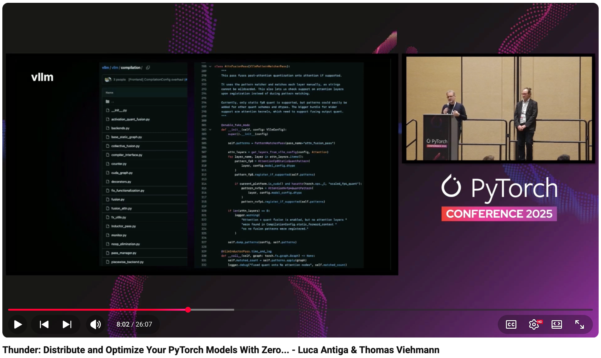

Thunder: Distribute and Optimize Your PyTorch Models With Zero Code Changes - Luca Antiga & Thomas Viehmann, Lightning AI Since its early days, PyTorch has empowered researchers and practitioners with

## vLLM: Easy, Fast, and Cheap LLM Serving for Everyone - Simon Mo, vLLM
- Link: https://www.youtube.com/watch?v=Tv71-g75OgU

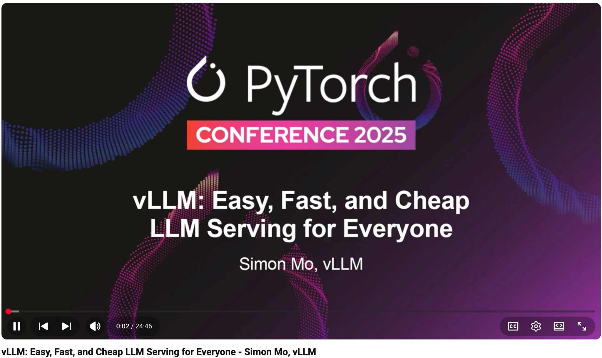

vLLM: Easy, Fast, and Cheap LLM Serving for Everyone - Simon Mo, vLLM vLLM is an open source library for fast, easy-to-use LLM inference and serving. It optimizes hundreds of language models across di

## Sponsored Session: Amazingly Fast and Incredibly Scalable Inference with NVIDIA's Dynamo and TensorRT-LLM - Harry Kim & Laikh Tewari
- Link: https://www.youtube.com/watch?v=DJxIc2HDiG8

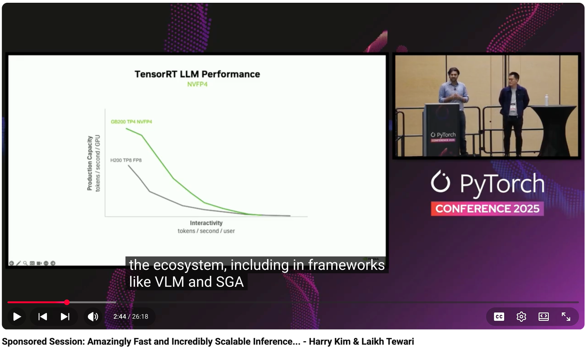

Sponsored Session: Amazingly Fast and Incredibly Scalable Inference with NVIDIA's Dynamo and TensorRT-LLM - Harry Kim & Laikh Tewari, NVIDIA The explosive growth of large language models demands new t

## Lightning Talk: Unlock the Future of Generative AI: TorchTitan's Latest Breakthroughs - Tianyu Liu & Jiani Wang
- Link: https://www.youtube.com/watch?v=JMbZBI0ypzc

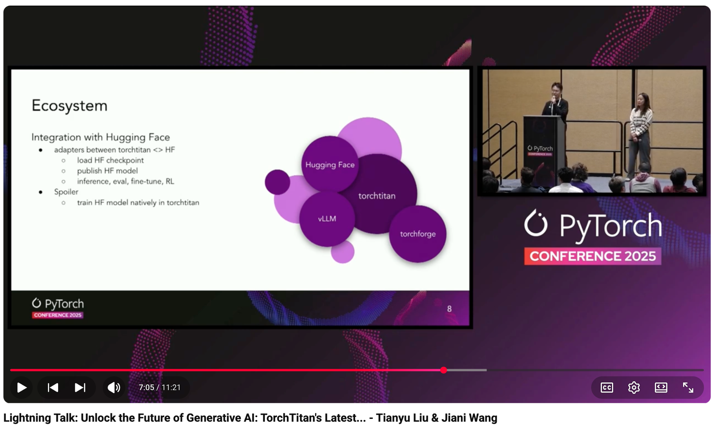

Lightning Talk: Unlock the Future of Generative AI: TorchTitan's Latest Breakthroughs - Tianyu Liu & Jiani Wang, Meta We're excited to share the latest advancements in TorchTitan (https://github.com/p

## Breaking Heterogeneity Barriers: Unified Cloud-to-Robot AI System SW Stack for Embodied Intelligence - Yonghua Lin
- Link: https://www.youtube.com/watch?v=gjPQ8J38SSw

Breaking Heterogeneity Barriers: Unified Cloud-to-Robot AI System SW Stack for Embodied Intelligence - Yonghua Lin, BAAI Embodied AI demands unprecedented efficiency: brain-planning models (VLM) evolv

## Lightning Talk: Flex Attention for Inference - Boyuan Feng & Driss Guessous, Meta
- Link: https://www.youtube.com/watch?v=2xcvgyO4F_o

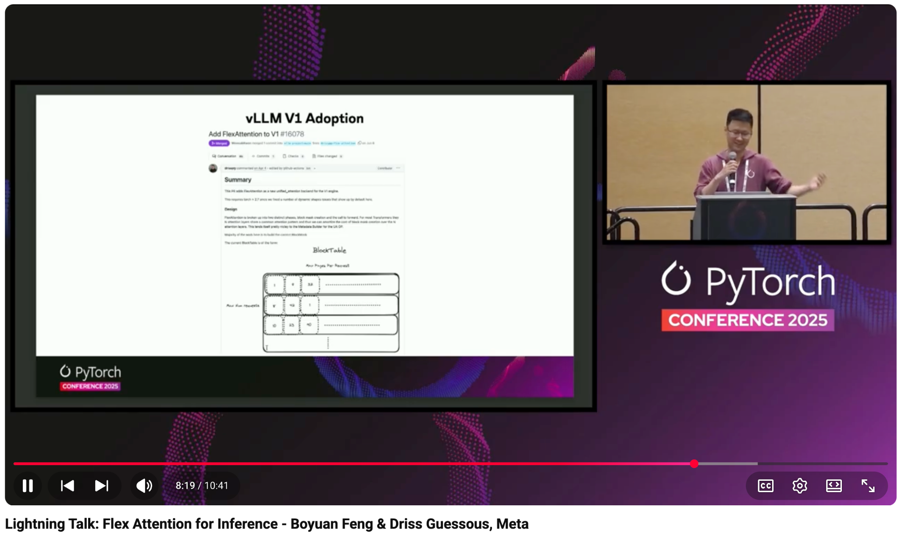

Lightning Talk: Flex Attention for Inference - Boyuan Feng & Driss Guessous, Meta FlexAttention is a novel compiler-driven programming model that allows implementing the majority of attention variants

## Sponsored Session: Lightning Talk: Improving Drug Discovery with Machine Learning and Molecular Dynamics - Simon Axelrod
- Link: https://www.youtube.com/watch?v=jgf-dGXJQk8

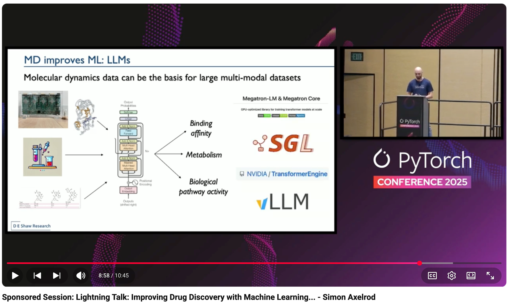

Sponsored Session: Lightning Talk: Improving Drug Discovery with Machine Learning and Molecular Dynamics - Simon Axelrod, D.E. Shaw Research Learn about how D. E. Shaw Research uses paradigm-shifting

## Sponsored Session: Lightning Talk: Accelerated Software for a Post-Moore World - Jay Dawani
- Link: https://www.youtube.com/watch?v=cuL3vER4QTU

Sponsored Session: Lightning Talk: Accelerated Software for a Post-Moore World - Jay Dawani, Lemurian Labs Moore’s law has slowed while workloads grow and get more dynamic. Hardware is increasingly he

## Sponsored Session: Building the Next Generation of Open Source AI Tooling - Travis Oliphant
- Link: https://www.youtube.com/watch?v=Vnv5OalptH4

Sponsored Session: Building the Next Generation of Open Source AI Tooling - Travis Oliphant, OpenTeams The AI ecosystem is built on Open Source. We face new challenges at all levels of the AI stack. F

## No GPU Left Behind: Scaling Online LLM Training With Co-located VLLM in TRL - Mert Toslali & Yu Chin Fabian Lim
- Link: https://www.youtube.com/watch?v=ebklfF5XVs8

No GPU Left Behind: Scaling Online LLM Training With Co-located VLLM in TRL - Mert Toslali & Yu Chin Fabian Lim, IBM Research Training LLMs with online RL methods like GRPO presents a unique challenge

## Lightning Talk: Challenges and Standardization in PyTorch Ecosystem Accelerators - Zesheng Zong & Ashok Emani
- Link: https://www.youtube.com/watch?v=rTi0z32i8XE

Lightning Talk: Challenges and Standardization in PyTorch Ecosystem Accelerators - Zesheng Zong, Huawei & Ashok Emani, Intel This talk aims to provide a practical and structured overview of the curren

## Keynote: Building the Open Agent Ecosystem Together: Introducing OpenEnv- Joe Spisak, Lysandre Debut
- Link: https://www.youtube.com/watch?v=EflwqcbRYYs

Keynote: Building the Open Agent Ecosystem Together: Introducing OpenEnv - Joe Spisak, Product Director, Meta & Lysandre Debut, Chief Open Source Officer, Hugging Face

## Enabling VLLM V1 on AMD GPUs With Triton - Thomas Parnell, IBM Research & Aleksandr Malyshev, AMD
- Link: https://www.youtube.com/watch?v=Ylp1Pt1nvEU

Enabling VLLM V1 on AMD GPUs With Triton - Thomas Parnell, IBM Research & Aleksandr Malyshev, AMD In January 2025, vLLM announced the alpha release of V1: a major upgrade to vLLM’s core architecture.

## Transformers: Standardizing Model Definitions Across the PyTorch Ecosystem - L. Debut & A. Zucker
- Link: https://www.youtube.com/watch?v=B-NKBmwMvAs

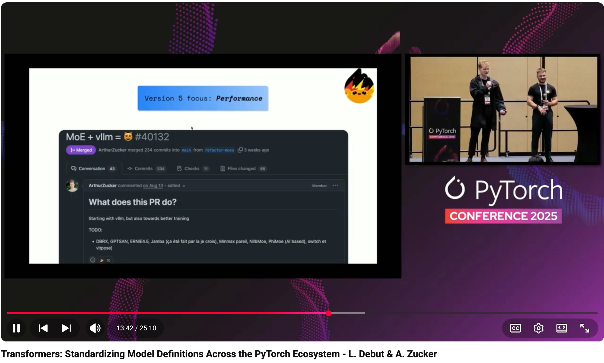

Transformers: Standardizing Model Definitions Across the PyTorch Ecosystem - Lysandre Debut & Arthur Zucker, Hugging Face Transformers is relied upon to set the standard of model definitions across th

## How Modern PyTorch Supercharges Multimodal Training and Inference at Luma AI - Thomas Neff, Luma AI
- Link: https://www.youtube.com/watch?v=LmpXU8UwREA

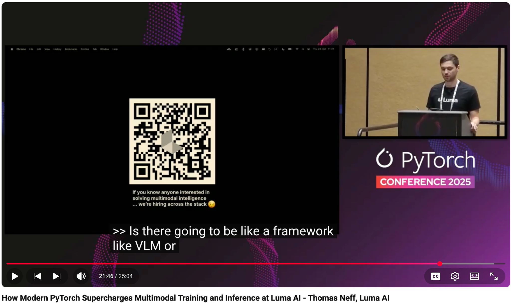

How Modern PyTorch Supercharges Multimodal Training and Inference at Luma AI - Thomas Neff, Luma AI Luma AI was the first company to release a "new generation" video generative model powered by large

## Optimizing Long-Tail and MoE Challenges in Reinforcement Learning with SGLang - Chenyang Zhao, UCLA
- Link: https://www.youtube.com/watch?v=5MC-P33ng1k

Optimizing Long-Tail and MoE Challenges in Reinforcement Learning with SGLang - Chenyang Zhao, UCLA The increasing complexity of multi-turn interactions and the adoption of advanced architectures like

## Serving PyTorch LLMs at Scale: Disaggregated Inference With Kubernetes and Llm-d - M. Ayoub & C. Liu
- Link: https://www.youtube.com/watch?v=mfXIe_S53vA

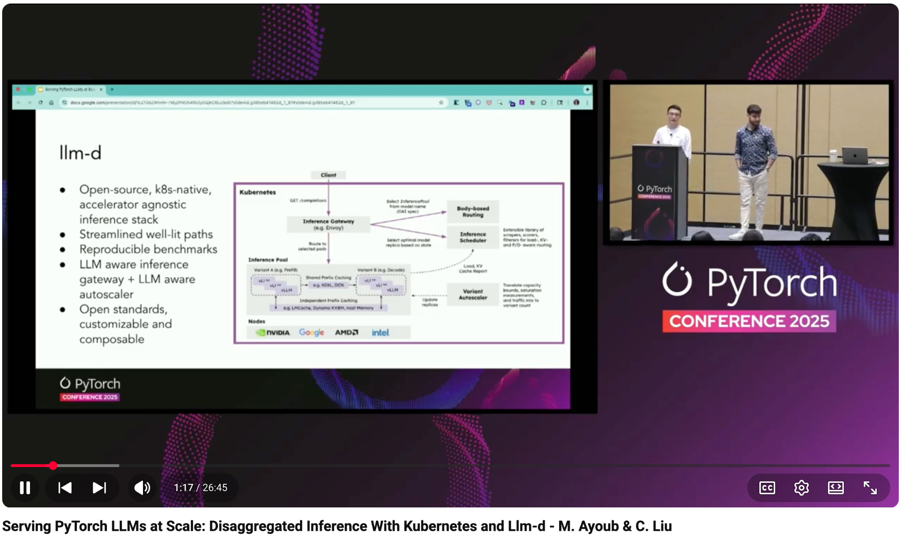

Serving PyTorch LLMs at Scale: Disaggregated Inference With Kubernetes and Llm-d - Maroon Ayoub, IBM Research & Cong Liu, Google As PyTorch-based LLMs scale in complexity and user concurrency, their i

## Verl: A Flexible and Efficient RL Framework for LLMs - Hongpeng Guo & Ziheng Jiang, ByteDance Seed
- Link: https://www.youtube.com/watch?v=U4w8X8ycoY8

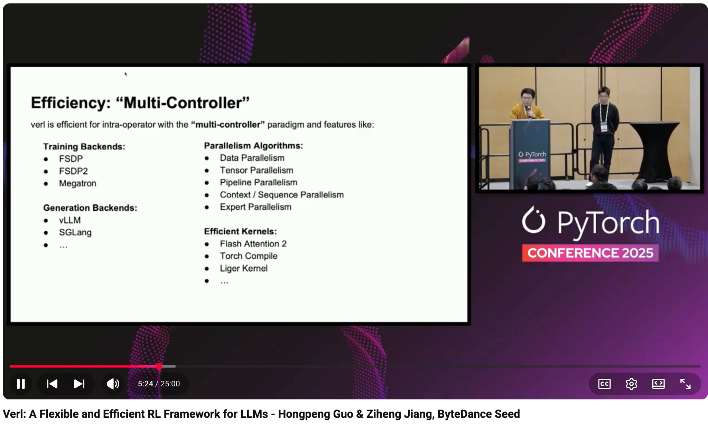

Verl: A Flexible and Efficient RL Framework for LLMs - Hongpeng Guo & Ziheng Jiang, ByteDance Seed Large language models (LLMs) have unlocked capabilities in language understanding and multimodal task

## Sponsored Session: Lightning Talk: PyTorch and Democratization of AI Accelerators - Hong-Seok Kim
- Link: https://www.youtube.com/watch?v=6qU802syw8U

Sponsored Session: Lightning Talk: PyTorch and Democratization of AI Accelerators - Hong-Seok Kim, Rebellions PyTorch, much like other influential open-source projects such as Linux and GCC, has alway

## Multi-Accelerator PyTorch Serving With NxD Inference and vLLM - Yahav Biran & Liangfu Chen, Amazon
- Link: https://www.youtube.com/watch?v=aoZwgbedQo4

Multi-Accelerator PyTorch Serving With NxD Inference and vLLM - Yahav Biran & Liangfu Chen, Amazon Learn how the open-source NxD Inference library delivers high-performance PyTorch model serving on AW

## Scaling KV Caches for LLMs: How LMCache + NIXL Handle Network and Storage Heterogeneity - J. Jiang & M. Khazraee
- Link: https://www.youtube.com/watch?v=87T-irSjXfE

Scaling KV Caches for LLMs: How LMCache + NIXL Handle Network and Storage Heterogeneity - Junchen Jiang, University of Chicago & Moein Khazraee, NVIDIA Efficient KV cache management is critical for sc

## Sponsored Session: Lightning Talk: PyTorch in Production: Boosting LLM Training and Inferencing on Ascend NPU - F. Hua
- Link: https://www.youtube.com/watch?v=S35GNcO8mhk

Sponsored Session: Lightning Talk: PyTorch in Production: Boosting LLM Training and Inferencing on Ascend NPU - Fengchun Hua, Huawei In scenarios of diverse computing power, PyTorch faces significant

## Keynote Panel: Hardwares & Accelerators - D Patel, S Zhou, P Salanki, N Perumbeti, M Saroufim
- Link: https://www.youtube.com/watch?v=2QZ8Xd1rhXI

Keynote Panel Discussion: Hardwares & Accelerators - Dylan Patel, Founder, CEO & Chief Analyst, SemiAnalysis; Sharon Zhou, VP of AI, AMD; Peter Salanki, Co-founder & CTO, CoreWeave; Nitin Perumbeti, C

## Blazing Fast GenAI Inference With Torch.compile - Richard Zou, Meta
- Link: https://www.youtube.com/watch?v=1wV1ESbGrVQ

Blazing Fast GenAI Inference With Torch.compile - Richard Zou, Meta This talk dives into Generative AI (GenAI) inference, highlighting key features of torch.compile that make it well suited for this r

## Sponsored Session: Empowering AI Everywhere: Democratizing PyTorch with Intel AIPCs & More - F. Zhao & E. Wang
- Link: https://www.youtube.com/watch?v=Fvm2XYHH6Rw

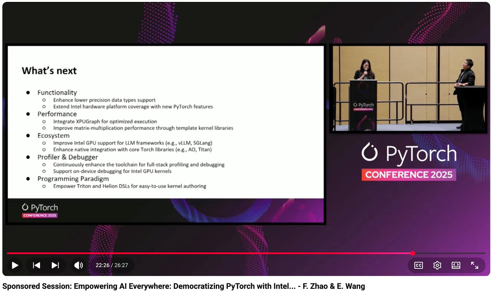

Sponsored Session: Empowering AI Everywhere: Democratizing PyTorch with Intel AIPCs & More - Fan Zhao & Eikan Wang, Intel PyTorch has become a cornerstone for AI development, powering everything from

## Designing and Building Custom Reinforcement Learning Environments for Fine-tuning LLMs - N. Bantilan
- Link: https://www.youtube.com/watch?v=8wdH9EZcZQM

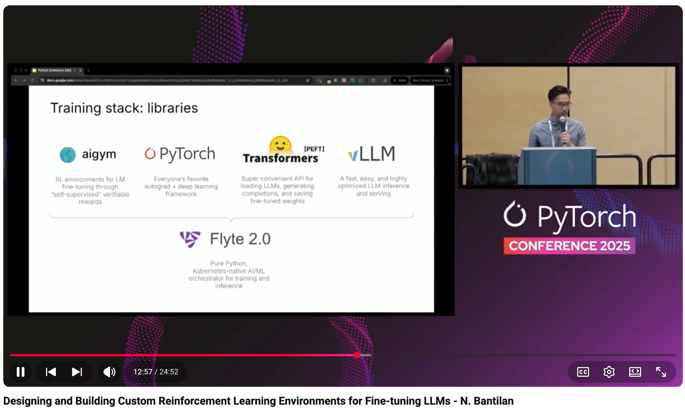

Designing and Building Custom Reinforcement Learning Environments for Fine-tuning LLMs - Niels Bantilan, Union.ai Techniques like GRPO, combined with reinforcement learning with verifiable rewards (RL

## Sponsored Session: Accelerating GenAI Inference: From AWS Deep Learning Containers to Scaling Amazon Rufus on Trainium - P. Nguyen & A. Zhao
- Link: https://www.youtube.com/watch?v=A51vytMF06s

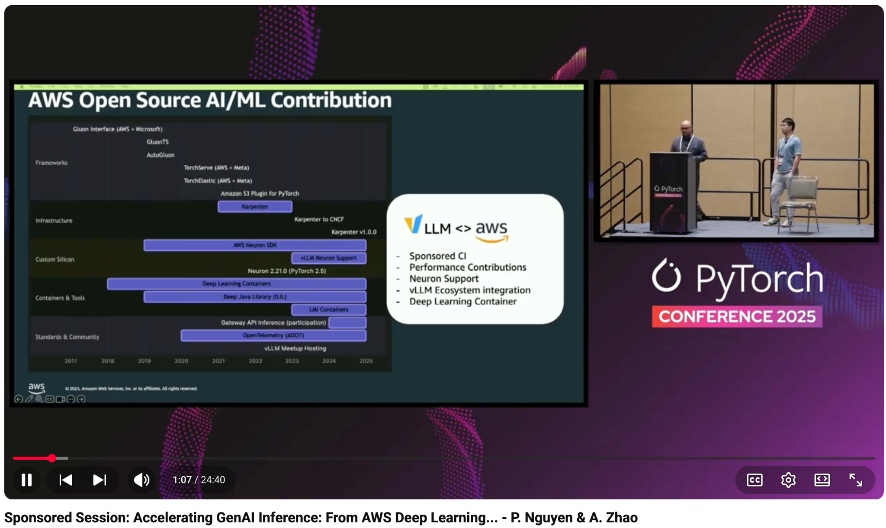

Sponsored Session: Accelerating GenAI Inference: From AWS Deep Learning Containers to Scaling Amazon Rufus on Trainium - Phi Nguyen & Adam Zhao, AWS The rapid evolution of LLMs and reasoning models de

## Lightning Talk: Vllm-triton-backend: How To Get State-of-the-art Performance on NVIDIA and AMD With Just Triton - B. Ringlein
- Link: https://www.youtube.com/watch?v=5vmbRVXBvVM

Lightning Talk: Vllm-triton-backend: How To Get State-of-the-art Performance on NVIDIA and AMD With Just Triton - Burkhard Ringlein, IBM Today, vLLM (part of pytorch) is the de-facto industry standard

## Sponsored Session: Lightning Talk: Efficient Inference Serving with Kubernetes Gateway API Inference Extension - Lin Sun
- Link: https://www.youtube.com/watch?v=vBLDv_bzgo8

Sponsored Session: Lightning Talk: Efficient Inference Serving with Kubernetes Gateway API Inference Extension - Lin Sun, Solo.io & CNCF Large Language Models (LLMs) have become the backbone of modern

## Lightning Talk: Improved GEMM and SDPA Performance on ROCm With Composable Kernel - Andres Lugo, AMD
- Link: https://www.youtube.com/watch?v=bc7x6cmMB8Q

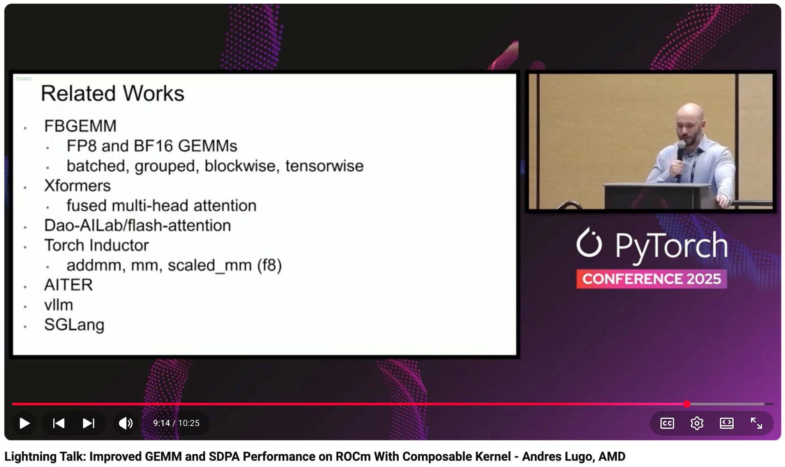

Lightning Talk: Improved GEMM and SDPA Performance on ROCm With Composable Kernel - Andres Lugo, AMD As the artificial intelligence space continues to grow and evolve with increasingly complex use cas

## Kimi K2 and Our Contributions to Open Source - Yuxin Wu, Moonshot AI
- Link: https://www.youtube.com/watch?v=QLDpiOOyyrE

Kimi K2 and Our Contributions to Open Source - Yuxin Wu, Moonshot AI We'll first introduce Kimi K2, our open-weight 1T parameter foundation model with strong agentic capabilities. We'll talk about how

## Lightning Talk: A Stable Limited LibTorch ABI? How?! (and Why?) - Jane Xu, Meta
- Link: https://www.youtube.com/watch?v=HNdEmnvMvGE

Lightning Talk: A Stable Limited LibTorch ABI? How?! (and Why?) - Jane Xu, Meta Do you use or maintain third-party C++/CUDA extensions with torch? (Think flash attention :)) Would you like to build th

## Sponsored Session: Arctic Inference: Breaking the Speed-Cost Tradeoff in LLM Serving - Aurick Qiao
- Link: https://www.youtube.com/watch?v=KhRdtntTp-I

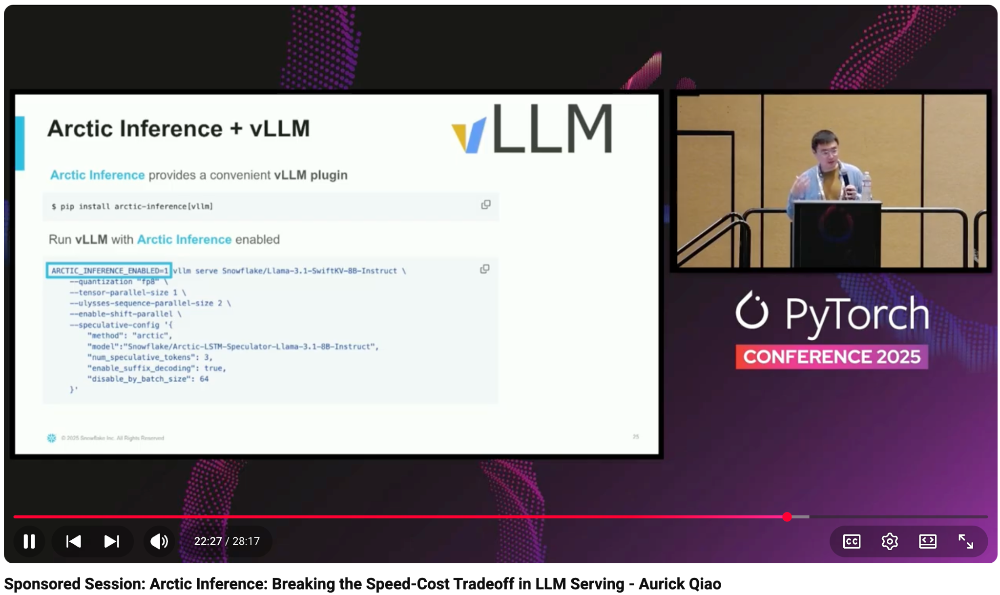

Sponsored Session: Arctic Inference: Breaking the Speed-Cost Tradeoff in LLM Serving - Aurick Qiao, Snowflake Arctic Inference is an open-source extension to vLLM, developed by Snowflake AI Research,

## PyTorch Conference 2025 Recap
- Link: https://www.youtube.com/watch?v=yoJfYiodlos

More than 3,000 developers, researchers, and innovators gathered in San Francisco for #PyTorchCon 2025. 2 days of keynotes, technical sessions, and community connection across the global AI ecosystem.