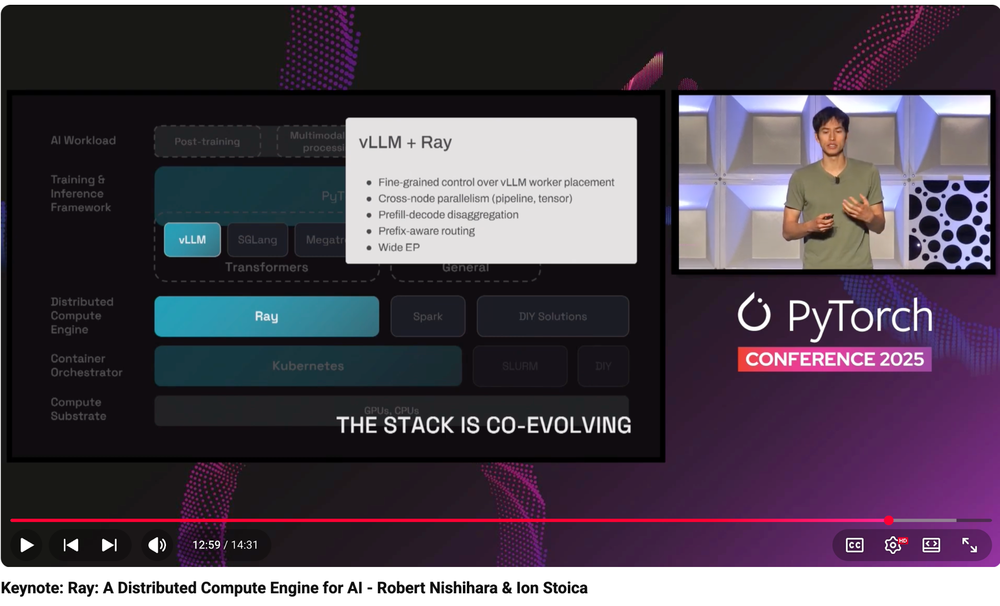

# Keynote: Ray: A Distributed Compute Engine for AI - Robert Nishihara & Ion Stoica

- Index: 4
- Video: https://www.youtube.com/watch?v=B7U05Y4YcJg

## Description

Keynote: Ray: A Distributed Compute Engine for AI - Robert Nishihara, Co-Founder, Anyscale & Co-creator, Ray; Ion Stoica, Professor of Computer Science, UC Berkeley; Director of Sky Computing Lab; & C
