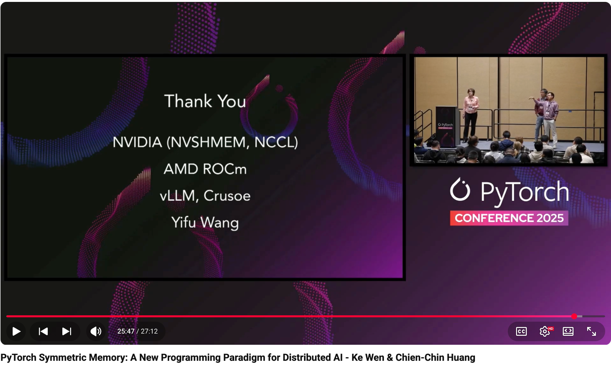

# PyTorch Symmetric Memory: A New Programming Paradigm for Distributed AI - Ke Wen & Chien-Chin Huang

- Index: 12
- Video: https://www.youtube.com/watch?v=5vfcTjosGLg

## Description

PyTorch Symmetric Memory: A New Programming Paradigm for Distributed AI - Ke Wen & Chien-Chin Huang, Meta Recent advancements in models led by DeepSeek have highlighted the need for customized communi
