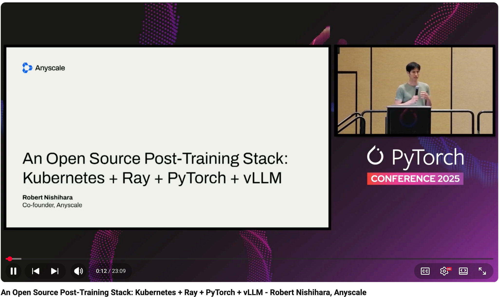

# An Open Source Post-Training Stack: Kubernetes + Ray + PyTorch + vLLM - Robert Nishihara, Anyscale

- Index: 37
- Video: https://www.youtube.com/watch?v=JEM-tA3XDjc

## Description

An Open Source Post-Training Stack: Kubernetes + Ray + PyTorch + vLLM - Robert Nishihara, Anyscale AI workloads require increasing scale for both compute and data, as well as significant heterogeneity
