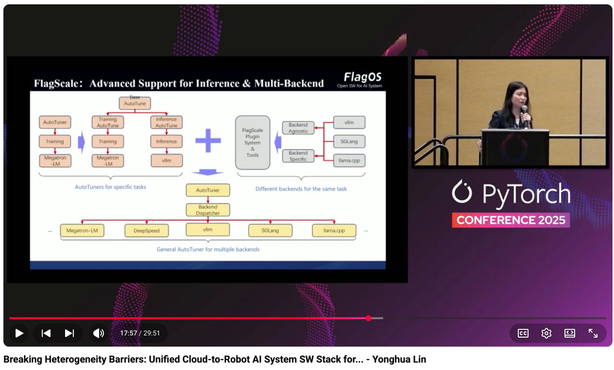

# Breaking Heterogeneity Barriers: Unified Cloud-to-Robot AI System SW Stack for Embodied Intelligence - Yonghua Lin

- Index: 51
- Video: https://www.youtube.com/watch?v=gjPQ8J38SSw

## Description

Breaking Heterogeneity Barriers: Unified Cloud-to-Robot AI System SW Stack for Embodied Intelligence - Yonghua Lin, BAAI Embodied AI demands unprecedented efficiency: brain-planning models (VLM) evolv
