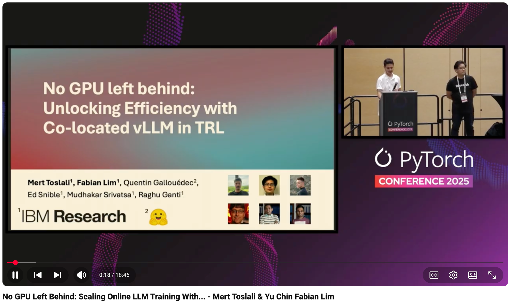

# No GPU Left Behind: Scaling Online LLM Training With Co-located VLLM in TRL - Mert Toslali & Yu Chin Fabian Lim

- Index: 60
- Video: https://www.youtube.com/watch?v=ebklfF5XVs8

## Description

No GPU Left Behind: Scaling Online LLM Training With Co-located VLLM in TRL - Mert Toslali & Yu Chin Fabian Lim, IBM Research Training LLMs with online RL methods like GRPO presents a unique challenge
