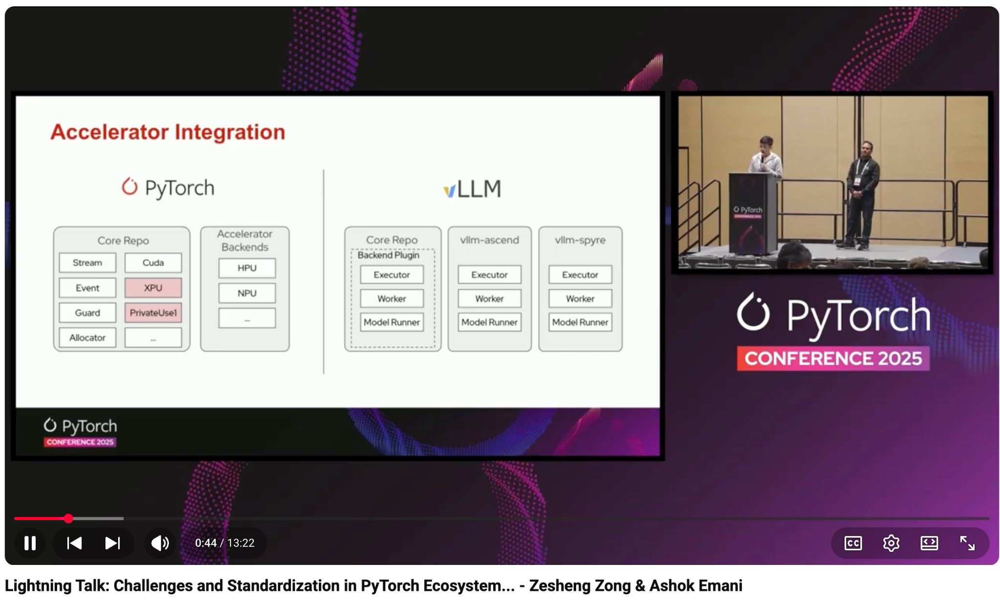

# Lightning Talk: Challenges and Standardization in PyTorch Ecosystem Accelerators - Zesheng Zong & Ashok Emani

- Index: 62
- Video: https://www.youtube.com/watch?v=rTi0z32i8XE

## Description

Lightning Talk: Challenges and Standardization in PyTorch Ecosystem Accelerators - Zesheng Zong, Huawei & Ashok Emani, Intel This talk aims to provide a practical and structured overview of the curren
