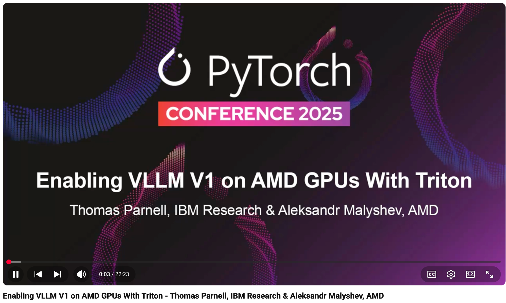

# Enabling VLLM V1 on AMD GPUs With Triton - Thomas Parnell, IBM Research & Aleksandr Malyshev, AMD

- Index: 69
- Video: https://www.youtube.com/watch?v=Ylp1Pt1nvEU

## Description

Enabling VLLM V1 on AMD GPUs With Triton - Thomas Parnell, IBM Research & Aleksandr Malyshev, AMD In January 2025, vLLM announced the alpha release of V1: a major upgrade to vLLM’s core architecture.
