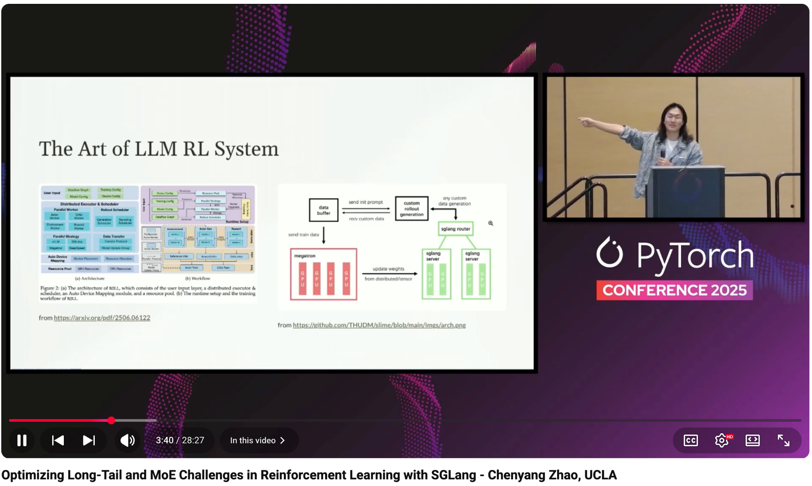

# Optimizing Long-Tail and MoE Challenges in Reinforcement Learning with SGLang - Chenyang Zhao, UCLA

- Index: 74
- Video: https://www.youtube.com/watch?v=5MC-P33ng1k

## Description

Optimizing Long-Tail and MoE Challenges in Reinforcement Learning with SGLang - Chenyang Zhao, UCLA The increasing complexity of multi-turn interactions and the adoption of advanced architectures like
