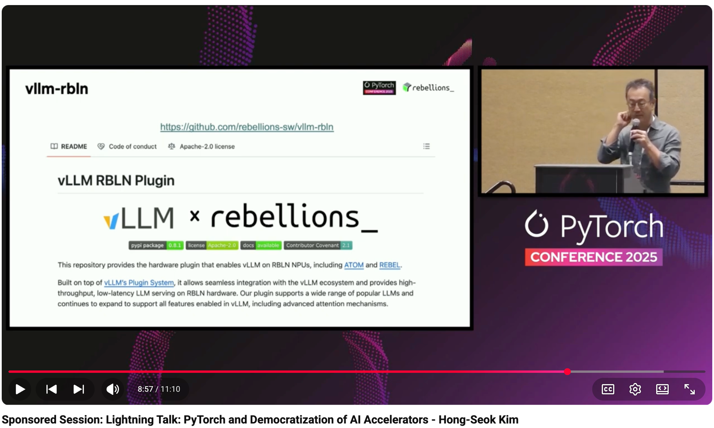

# Sponsored Session: Lightning Talk: PyTorch and Democratization of AI Accelerators - Hong-Seok Kim

- Index: 80
- Video: https://www.youtube.com/watch?v=6qU802syw8U

## Description

Sponsored Session: Lightning Talk: PyTorch and Democratization of AI Accelerators - Hong-Seok Kim, Rebellions PyTorch, much like other influential open-source projects such as Linux and GCC, has alway
