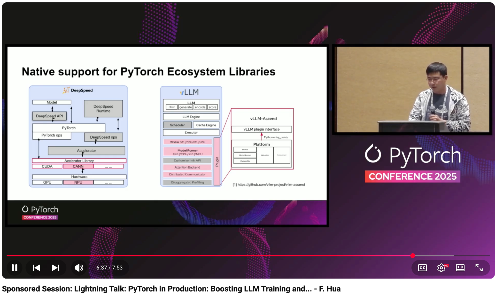

# Sponsored Session: Lightning Talk: PyTorch in Production: Boosting LLM Training and Inferencing on Ascend NPU - F. Hua

- Index: 85
- Video: https://www.youtube.com/watch?v=S35GNcO8mhk

## Description

Sponsored Session: Lightning Talk: PyTorch in Production: Boosting LLM Training and Inferencing on Ascend NPU - Fengchun Hua, Huawei In scenarios of diverse computing power, PyTorch faces significant
