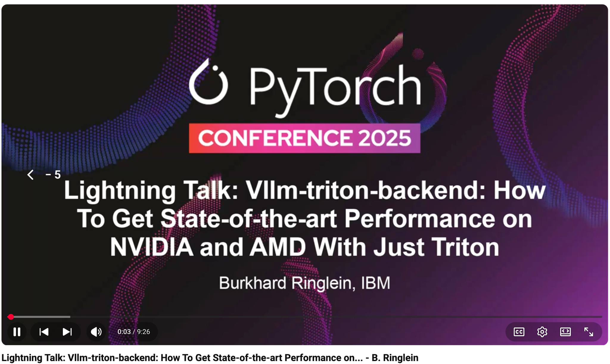

# Lightning Talk: Vllm-triton-backend: How To Get State-of-the-art Performance on NVIDIA and AMD With Just Triton - B. Ringlein

- Index: 98
- Video: https://www.youtube.com/watch?v=5vmbRVXBvVM

## Description

Lightning Talk: Vllm-triton-backend: How To Get State-of-the-art Performance on NVIDIA and AMD With Just Triton - Burkhard Ringlein, IBM Today, vLLM (part of pytorch) is the de-facto industry standard
