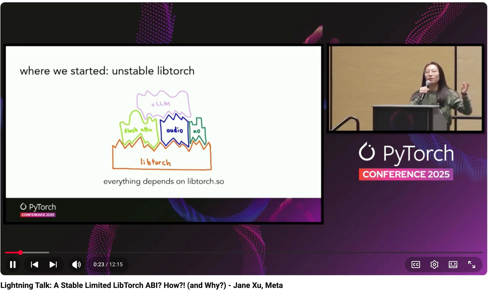

# Lightning Talk: A Stable Limited LibTorch ABI? How?! (and Why?) - Jane Xu, Meta

- Index: 112
- Video: https://www.youtube.com/watch?v=HNdEmnvMvGE

## Description

Lightning Talk: A Stable Limited LibTorch ABI? How?! (and Why?) - Jane Xu, Meta Do you use or maintain third-party C++/CUDA extensions with torch? (Think flash attention :)) Would you like to build th
